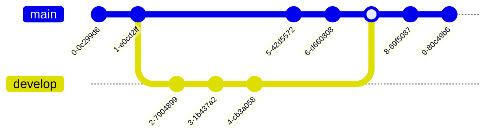

# A collection of Rust programs I wrote for practice

## Project description

A collection of coding challenge solutions written in Rust. Coding challenge description is given as _doc comments_ on top of each program. I write codes to solve problems from:

- https://www.hackerrank.com/
- https://code-exercises.com/

## Execution



### Clone repository  

```bash
gh repo clone sauravdwivedi/Rust
```

### Run code

```bash
cd Rust
rustc <script_name>.rs
./<script_name>
```

### Format code

```bash
rustfmt <script_name>.rs
```

### Rust Style guide

- https://doc.rust-lang.org/1.0.0/style/